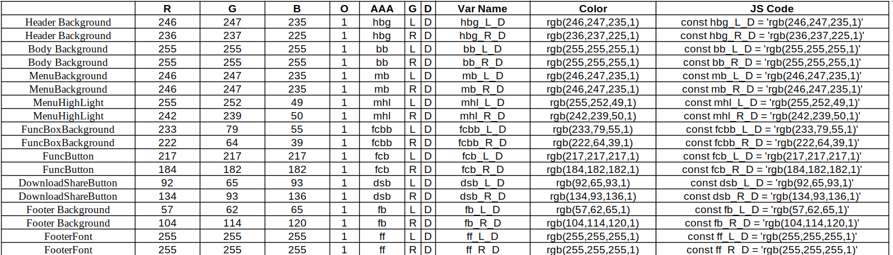
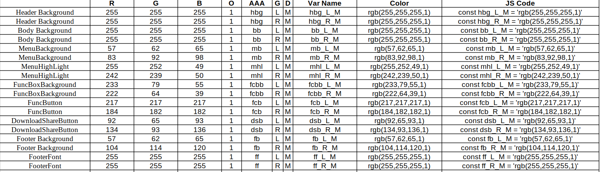

# ReactCalculator

## Introduction

 This project is for practicing and improving my skill in UI design using React. 
 
 

## Project WBS
1. <input type="checkbox" /> Prepare the project plan
2. <input type="checkbox" checked/> Wireframe in figma
    <ul>
        <input type="checkbox"  checked/> Mobile Frame  
        <input type="checkbox" checked/> Desktop Frame
    </ul>
3. <input type="checkbox" checked/> Select Color Scheme
4. <input type="checkbox" checked/> Design colorful in figma
5. <input type="checkbox" checked/> List Components
6. <input type="checkbox" checked/> List Functionalities
8. <input type="checkbox" checked/> List Usestates 
9. <input type="checkbox" checked/> List Component props and callBacks
10. <input type="checkbox" /> Create components
11. <input type="checkbox" /> Implement Visual Design
12. <input type="checkbox" /> Implement functionalities
13. <input type="checkbox" /> Test the App
14. <input type="checkbox" /> Finalize and Publish

## Notes:
--

## Color Themes:

 The color themes are selected from the website [Colors](https://coolors.co). These are my themes:
 <ul>
    <li><a href = "https://coolors.co/fffc31-5c415d-f6f7eb-e94f37-393e41" target="_blank">Color Theme</a></li>
 </ul>

## List of Components
<ol>
    <li>App</li>
    <li>Header</li>
    <li>NavBar</li>
    <li>
        FuncBar
        <ul>
            <li>uploadBox</li>
            <li>sizeInputBox</li>
            <li>resultBox</li>
        </ul>
    </li>
    <li>Footer</li>
</ol>
 

## List of Functionalities
<ol>
    <li></li>
</ol>

## Algorithms

1. 

## List of UseStates

<ol>
    <li>isMobile</li>
    <li>isHamburgerOpen</li>
    <li>uploadedImage</li>
    <li>newSize</li>
    <li>functionMode</li>
    <li>ProcessStage</li>
    <li>imageURL</li>
    <li>imageName</li>
    <li>imageSize</li>
    <li>imageType</li>
    <li>newImageUrl</li>
</ol>

## List of Component Props and callBacks

<table>
    <tr>
        <th>Component</th>
        <th>Props</th>
        <th>callback</th>
        <th>Parent</th>
    </tr>
    <tr>
        <td>App</td>
        <td>-</td>
        <td>-</td>
        <td>-</td>
    </tr>
    <tr>
        <td>Header</td>
        <td>isMobile, isHamburgerOpen, functionMode</td>
        <td></td>
        <td>App</td>
    </tr>
    <tr>
        <td>NavBar</td>
        <td>isMobile, isHamburgerOpen, functionMode</td>
        <td>changeFunctionMode</td>
        <td>App</td>
    </tr>
    <tr>
        <td>FuncBar</td>
        <td>isMobile, functionMode, ProcessStage, newSize </td>
        <td></td>
        <td>App</td>
    </tr>
    <tr>
        <td>uploadBox</td>
        <td>isMobile,functionMode,ProcessStage,imageURL, imageName, imageSize, imageType</td>
        <td>uploadImage</td>
        <td>FuncBar</td>
    </tr>
    <tr>
        <td>sizeInputBox</td>
        <td>isMobile,functionMode,ProcessStage, imageSize</td>
        <td>setImageSize</td>
        <td>FuncBar</td>
    </tr>
    <tr>
        <td>resultBox</td>
        <td>isMobile,functionMode,ProcessStage, newImageUrl</td>
        <td>downloadNewImage, shareNewImage</td>
        <td>FuncBar</td>
    </tr>
    <tr>
        <td>Banner</td>
        <td>-</td>
        <td>-</td>
        <td>App</td>
    </tr>
    <tr>
        <td>Footer</td>
        <td>-</td>
        <td>-</td>
        <td>App</td>
    </tr>

</table>

## CSS Variable Names Convention

AAA-GG

<table>
    <tr>
        <th>AAA</th>
        <th>Description</th>
    </tr>
    <tr>
        <td>hbg</td>
        <td>Header Background</td>
    </tr>
    <tr>
        <td>bb</td>
        <td>Body Background</td>
    </tr>
    <tr>
        <td>mb</td>
        <td>MenuBackground</td>
    </tr>
    <tr>
        <td>mhl</td>
        <td>MenuHighLight</td>
    </tr>
    <tr>
        <td>fcbb</td>
        <td>FuncBoxBackground</td>
    </tr>
    <tr>
        <td>fcb</td>
        <td>FuncButton</td>
    </tr>
    <tr>
        <td>dsb</td>
        <td>DownloadShareButton</td>
    </tr>
    <tr>
        <td>fb</td>
        <td>Footer Background</td>
    </tr>
    <tr>
        <td>ff</td>
        <td>FooterFont</td>
    </tr>
</table>

<table>
    <tr>
        <th>GG</th>
        <th>Description</th>
    </tr>
    <tr>
        <td>R</td>
        <td>Right color of gradient</td>
    </tr>
    <tr>
        <td>L</td>
        <td>Left color of gradient</td>
    </tr>
</table>

<table>
    <tr>
        <th>D</th>
        <th>Device</th>
    </tr>
    <tr>
        <td>D</td>
        <td>Desktop</td>
    </tr>
    <tr>
        <td>M</td>
        <td>Mobile</td>
    </tr>
</table>

The color codes is as follows:

# Getting Started with Create React App

This project was bootstrapped with [Create React App](https://github.com/facebook/create-react-app).

## Available Scripts

In the project directory, you can run:

### `npm start`

Runs the app in the development mode.\
Open [http://localhost:3000](http://localhost:3000) to view it in your browser.

The page will reload when you make changes.\
You may also see any lint errors in the console.

### `npm test`

Launches the test runner in the interactive watch mode.\
See the section about [running tests](https://facebook.github.io/create-react-app/docs/running-tests) for more information.

### `npm run build`

Builds the app for production to the `build` folder.\
It correctly bundles React in production mode and optimizes the build for the best performance.

The build is minified and the filenames include the hashes.\
Your app is ready to be deployed!

See the section about [deployment](https://facebook.github.io/create-react-app/docs/deployment) for more information.

### `npm run eject`

**Note: this is a one-way operation. Once you `eject`, you can't go back!**

If you aren't satisfied with the build tool and configuration choices, you can `eject` at any time. This command will remove the single build dependency from your project.

Instead, it will copy all the configuration files and the transitive dependencies (webpack, Babel, ESLint, etc) right into your project so you have full control over them. All of the commands except `eject` will still work, but they will point to the copied scripts so you can tweak them. At this point you're on your own.

You don't have to ever use `eject`. The curated feature set is suitable for small and middle deployments, and you shouldn't feel obligated to use this feature. However we understand that this tool wouldn't be useful if you couldn't customize it when you are ready for it.

## Learn More

You can learn more in the [Create React App documentation](https://facebook.github.io/create-react-app/docs/getting-started).

To learn React, check out the [React documentation](https://reactjs.org/).

### Code Splitting

This section has moved here: [https://facebook.github.io/create-react-app/docs/code-splitting](https://facebook.github.io/create-react-app/docs/code-splitting)

### Analyzing the Bundle Size

This section has moved here: [https://facebook.github.io/create-react-app/docs/analyzing-the-bundle-size](https://facebook.github.io/create-react-app/docs/analyzing-the-bundle-size)

### Making a Progressive Web App

This section has moved here: [https://facebook.github.io/create-react-app/docs/making-a-progressive-web-app](https://facebook.github.io/create-react-app/docs/making-a-progressive-web-app)

### Advanced Configuration

This section has moved here: [https://facebook.github.io/create-react-app/docs/advanced-configuration](https://facebook.github.io/create-react-app/docs/advanced-configuration)

### Deployment

This section has moved here: [https://facebook.github.io/create-react-app/docs/deployment](https://facebook.github.io/create-react-app/docs/deployment)

### `npm run build` fails to minify

This section has moved here: [https://facebook.github.io/create-react-app/docs/troubleshooting#npm-run-build-fails-to-minify](https://facebook.github.io/create-react-app/docs/troubleshooting#npm-run-build-fails-to-minify)
